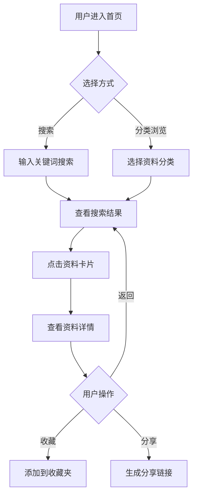
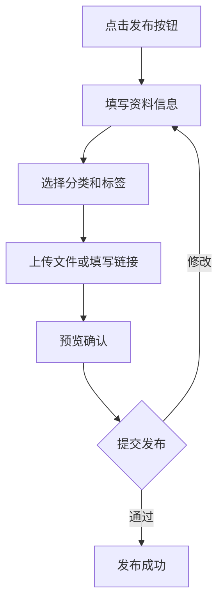

# 零碳资料搜集小程序 - 产品需求文档

## 1. 产品概述

零碳资料搜集小程序是一个专注于碳中和、低碳生活、环保知识领域的资料收集与管理工具。帮助用户便捷地搜集、整理、分类和分享零碳相关文章、报告、政策文件等资料，助力碳中和知识传播与实践。

- **目标用户**: 环保从业者、研究人员、企业ESG负责人、关注低碳生活的公众
- **核心价值**: 一站式零碳知识管理，提升资料搜集效率，促进碳中和知识共享

## 2. 核心功能

### 2.1 用户角色

| 角色 | 注册方式 | 核心权限 |
|------|----------|----------|
| 普通用户 | 邮箱注册 | 浏览公开资料、收藏、个人资料管理 |
| 注册用户 | 邮箱验证 | 发布资料、创建收藏夹、评论互动 |
| 管理员 | 后台指定 | 内容审核、用户管理、分类管理 |

### 2.2 功能模块

1. **首页**: 资料推荐、分类导航、搜索入口、热门标签
2. **资料库**: 资料列表、筛选排序、详情查看
3. **发布页**: 资料上传、信息填写、分类选择
4. **个人中心**: 我的收藏、发布记录、个人设置

### 2.3 页面详情

| 页面名称 | 模块名称 | 功能描述 |
|----------|----------|----------|
| 首页 | Hero区域 | 搜索框、热门关键词、快速入口 |
| 首页 | 分类导航 | 政策法规、研究报告、技术方案、案例分析、生活指南等分类卡片 |
| 首页 | 推荐资料 | 最新发布、热门推荐、精选内容的资料卡片列表 |
| 首页 | 标签云 | 碳中和、碳达峰、碳交易、新能源、绿色建筑等热门标签 |
| 资料库 | 筛选栏 | 分类筛选、时间筛选、来源筛选、排序方式 |
| 资料库 | 资料列表 | 资料卡片（标题、摘要、来源、时间、收藏数） |
| 资料库 | 详情页 | 资料完整内容、相关推荐、评论区、收藏按钮 |
| 发布页 | 表单区 | 标题、分类、来源、链接/文件、标签、摘要 |
| 发布页 | 预览区 | 发布预览、格式检查 |
| 个人中心 | 统计卡片 | 收藏数、发布数、获赞数 |
| 个人中心 | 收藏夹 | 分类收藏夹、收藏列表管理 |
| 个人中心 | 我的发布 | 发布记录、编辑删除 |

## 3. 核心流程

### 3.1 资料搜集流程

用户通过搜索或分类浏览找到目标资料，查看详情后可选择收藏到个人收藏夹，也可分享给其他用户。

### 3.2 资料发布流程

## 4. 用户界面设计

### 4.1 设计风格

- **主色调**: 翠绿色 (#10B981) - 象征环保与生机
- **辅助色**: 天蓝色 (#3B82F6) - 象征清洁天空
- **背景色**: 浅灰白 (#F9FAFB) - 清爽简洁
- **按钮风格**: 圆角按钮，带轻微阴影，hover时上浮效果
- **字体**: 标题使用思源黑体，正文使用系统默认字体
- **布局风格**: 卡片式布局，顶部导航栏，响应式设计
- **图标风格**: 线性图标，配合品牌色

### 4.2 页面设计概览

| 页面名称 | 模块名称 | UI元素 |
|----------|----------|--------|
| 首页 | Hero区域 | 渐变背景、大搜索框、热门标签气泡、动画效果 |
| 首页 | 分类导航 | 6个分类卡片、图标+文字、hover放大效果 |
| 首页 | 推荐资料 | 3列卡片网格、封面图+标题+标签、收藏按钮 |
| 资料库 | 筛选栏 | 下拉选择器、日期选择、标签筛选器 |
| 资料库 | 资料列表 | 无限滚动加载、骨架屏加载效果 |
| 资料详情 | 内容区 | Markdown渲染、目录导航、相关推荐侧栏 |
| 发布页 | 表单区 | 输入框、下拉选择、标签输入、富文本编辑器 |
| 个人中心 | 统计区 | 3个数据卡片、图标+数字+标签 |

### 4.3 响应式设计

- **桌面端优先**: 主要针对桌面端设计，提供完整功能体验
- **移动端适配**: 响应式布局，卡片单列显示，导航栏折叠为汉堡菜单
- **触控优化**: 按钮和卡片点击区域足够大，支持滑动操作

### 4.4 动效设计

- **页面加载**: 骨架屏 + 渐入动画
- **卡片悬停**: 轻微上浮 + 阴影加深
- **按钮点击**: 缩放反馈 + 颜色变化
- **页面切换**: 淡入淡出过渡
- **收藏成功**: 心形图标跳动 + 数量递增动画
