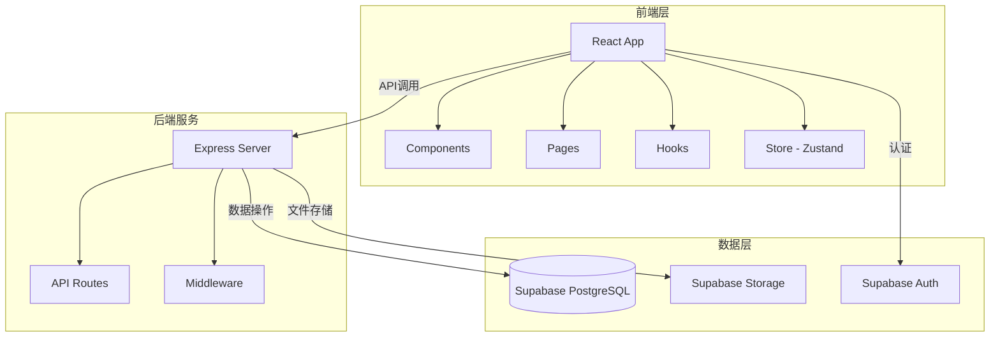
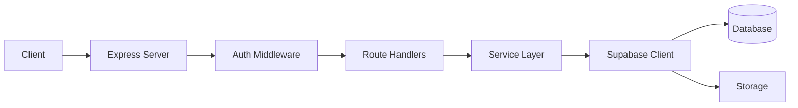
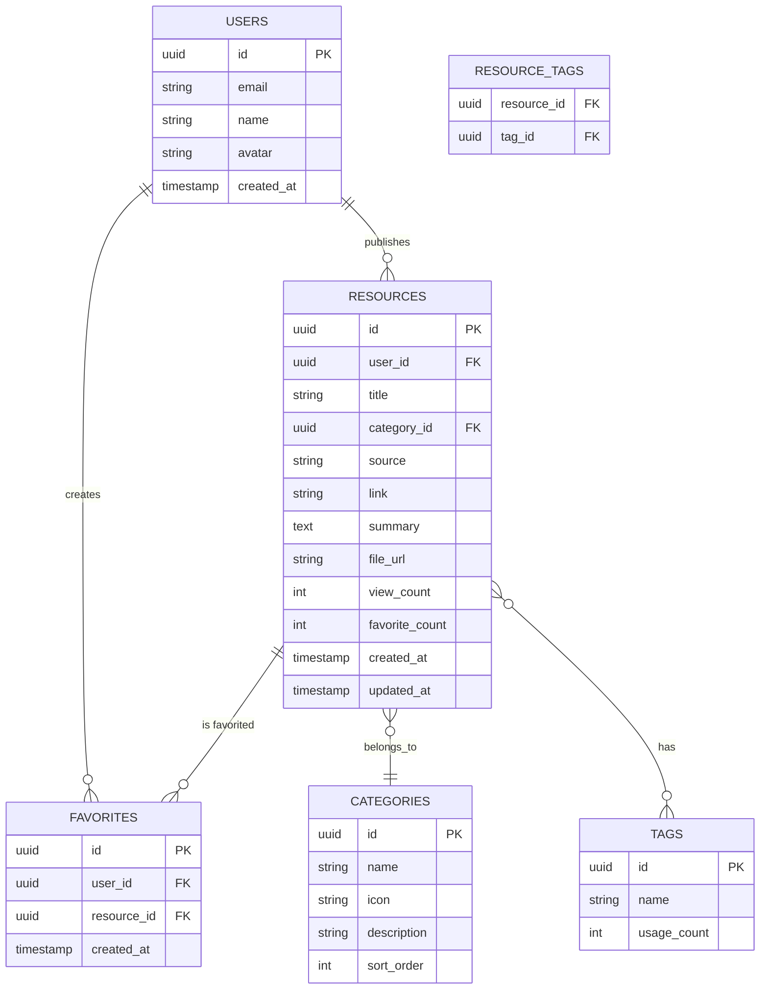

# 零碳资料搜集小程序 - 技术架构文档

## 1. 架构设计



## 2. 技术说明

- **前端**: React@18 + TypeScript + Tailwind CSS@3 + Vite
- **初始化工具**: vite-init
- **后端**: Express@4 + TypeScript
- **数据库**: Supabase (PostgreSQL)
- **认证**: Supabase Auth
- **存储**: Supabase Storage
- **状态管理**: Zustand
- **路由**: React Router DOM

## 3. 路由定义

| 路由 | 用途 | 组件 |
|------|------|------|
| `/` | 首页 | HomePage |
| `/library` | 资料库 | LibraryPage |
| `/library/:id` | 资料详情 | ResourceDetailPage |
| `/publish` | 发布资料 | PublishPage |
| `/profile` | 个人中心 | ProfilePage |
| `/login` | 登录 | LoginPage |
| `/register` | 注册 | RegisterPage |

## 4. API 定义

### 4.1 资料相关 API

```typescript
// 获取资料列表
GET /api/resources
Query: { category?: string; tag?: string; keyword?: string; page?: number; limit?: number }
Response: { data: Resource[]; total: number; page: number }

// 获取资料详情
GET /api/resources/:id
Response: Resource

// 创建资料
POST /api/resources
Body: { title: string; category: string; source: string; link?: string; tags: string[]; summary: string }
Response: Resource

// 更新资料
PUT /api/resources/:id
Body: Partial<Resource>
Response: Resource

// 删除资料
DELETE /api/resources/:id
Response: { success: boolean }
```

### 4.2 收藏相关 API

```typescript
// 收藏资料
POST /api/favorites
Body: { resourceId: string }
Response: { success: boolean }

// 取消收藏
DELETE /api/favorites/:resourceId
Response: { success: boolean }

// 获取收藏列表
GET /api/favorites
Response: Resource[]
```

### 4.3 用户相关 API

```typescript
// 获取用户信息
GET /api/users/me
Response: User

// 更新用户信息
PUT /api/users/me
Body: { name?: string; avatar?: string }
Response: User

// 获取用户发布记录
GET /api/users/me/resources
Response: Resource[]
```

## 5. 服务器架构图



## 6. 数据模型

### 6.1 数据模型定义



### 6.2 数据定义语言

```sql
-- 用户表 (由 Supabase Auth 管理，此处为扩展信息)
CREATE TABLE user_profiles (
    id UUID PRIMARY KEY REFERENCES auth.users(id) ON DELETE CASCADE,
    name VARCHAR(100),
    avatar TEXT,
    created_at TIMESTAMP WITH TIME ZONE DEFAULT NOW(),
    updated_at TIMESTAMP WITH TIME ZONE DEFAULT NOW()
);

-- 分类表
CREATE TABLE categories (
    id UUID PRIMARY KEY DEFAULT gen_random_uuid(),
    name VARCHAR(50) NOT NULL,
    icon VARCHAR(50),
    description TEXT,
    sort_order INT DEFAULT 0,
    created_at TIMESTAMP WITH TIME ZONE DEFAULT NOW()
);

-- 标签表
CREATE TABLE tags (
    id UUID PRIMARY KEY DEFAULT gen_random_uuid(),
    name VARCHAR(50) NOT NULL UNIQUE,
    usage_count INT DEFAULT 0,
    created_at TIMESTAMP WITH TIME ZONE DEFAULT NOW()
);

-- 资料表
CREATE TABLE resources (
    id UUID PRIMARY KEY DEFAULT gen_random_uuid(),
    user_id UUID NOT NULL REFERENCES user_profiles(id) ON DELETE CASCADE,
    title VARCHAR(200) NOT NULL,
    category_id UUID REFERENCES categories(id) ON DELETE SET NULL,
    source VARCHAR(200),
    link TEXT,
    summary TEXT,
    file_url TEXT,
    view_count INT DEFAULT 0,
    favorite_count INT DEFAULT 0,
    status VARCHAR(20) DEFAULT 'published',
    created_at TIMESTAMP WITH TIME ZONE DEFAULT NOW(),
    updated_at TIMESTAMP WITH TIME ZONE DEFAULT NOW()
);

-- 资料标签关联表
CREATE TABLE resource_tags (
    resource_id UUID REFERENCES resources(id) ON DELETE CASCADE,
    tag_id UUID REFERENCES tags(id) ON DELETE CASCADE,
    PRIMARY KEY (resource_id, tag_id)
);

-- 收藏表
CREATE TABLE favorites (
    id UUID PRIMARY KEY DEFAULT gen_random_uuid(),
    user_id UUID NOT NULL REFERENCES user_profiles(id) ON DELETE CASCADE,
    resource_id UUID NOT NULL REFERENCES resources(id) ON DELETE CASCADE,
    created_at TIMESTAMP WITH TIME ZONE DEFAULT NOW(),
    UNIQUE(user_id, resource_id)
);

-- 创建索引
CREATE INDEX idx_resources_user_id ON resources(user_id);
CREATE INDEX idx_resources_category_id ON resources(category_id);
CREATE INDEX idx_resources_created_at ON resources(created_at DESC);
CREATE INDEX idx_favorites_user_id ON favorites(user_id);
CREATE INDEX idx_tags_name ON tags(name);

-- 初始化分类数据
INSERT INTO categories (name, icon, description, sort_order) VALUES
('政策法规', 'Scale', '碳中和相关政策、法规、标准文件', 1),
('研究报告', 'FileText', '行业研究报告、白皮书、调研分析', 2),
('技术方案', 'Lightbulb', '低碳技术方案、工程案例、技术应用', 3),
('案例分析', 'Building2', '企业碳中和实践案例、成功经验', 4),
('生活指南', 'Leaf', '低碳生活指南、环保小贴士、绿色消费', 5),
('数据统计', 'BarChart3', '碳排放数据、行业统计、趋势分析', 6);

-- 启用 RLS
ALTER TABLE user_profiles ENABLE ROW LEVEL SECURITY;
ALTER TABLE resources ENABLE ROW LEVEL SECURITY;
ALTER TABLE favorites ENABLE ROW LEVEL SECURITY;
ALTER TABLE tags ENABLE ROW LEVEL SECURITY;
ALTER TABLE categories ENABLE ROW LEVEL SECURITY;
ALTER TABLE resource_tags ENABLE ROW LEVEL SECURITY;

-- RLS 策略
-- 用户资料：所有人可读，仅本人可写
CREATE POLICY "用户资料公开可读" ON user_profiles FOR SELECT USING (true);
CREATE POLICY "用户本人可更新" ON user_profiles FOR UPDATE USING (auth.uid() = id);
CREATE POLICY "用户本人可插入" ON user_profiles FOR INSERT WITH CHECK (auth.uid() = id);

-- 资料表：所有人可读已发布内容，作者可管理自己的内容
CREATE POLICY "资料公开可读" ON resources FOR SELECT USING (status = 'published' OR auth.uid() = user_id);
CREATE POLICY "登录用户可发布" ON resources FOR INSERT WITH CHECK (auth.uid() = user_id);
CREATE POLICY "作者可更新" ON resources FOR UPDATE USING (auth.uid() = user_id);
CREATE POLICY "作者可删除" ON resources FOR DELETE USING (auth.uid() = user_id);

-- 收藏表：仅本人可管理自己的收藏
CREATE POLICY "用户可查看自己的收藏" ON favorites FOR SELECT USING (auth.uid() = user_id);
CREATE POLICY "用户可添加收藏" ON favorites FOR INSERT WITH CHECK (auth.uid() = user_id);
CREATE POLICY "用户可删除收藏" ON favorites FOR DELETE USING (auth.uid() = user_id);

-- 分类和标签：所有人可读
CREATE POLICY "分类公开可读" ON categories FOR SELECT USING (true);
CREATE POLICY "标签公开可读" ON tags FOR SELECT USING (true);
CREATE POLICY "标签关联公开可读" ON resource_tags FOR SELECT USING (true);

-- 授权
GRANT SELECT ON categories TO anon;
GRANT SELECT ON categories TO authenticated;
GRANT SELECT ON tags TO anon;
GRANT SELECT ON tags TO authenticated;
GRANT SELECT ON resource_tags TO anon;
GRANT SELECT ON resource_tags TO authenticated;
GRANT SELECT ON user_profiles TO anon;
GRANT SELECT ON user_profiles TO authenticated;
GRANT ALL PRIVILEGES ON user_profiles TO authenticated;
GRANT SELECT ON resources TO anon;
GRANT ALL PRIVILEGES ON resources TO authenticated;
GRANT SELECT ON favorites TO anon;
GRANT ALL PRIVILEGES ON favorites TO authenticated;
```

## 7. 目录结构

```
零碳小程序/
├── src/
│   ├── components/          # 公共组件
│   │   ├── Layout/          # 布局组件
│   │   ├── ResourceCard/    # 资料卡片
│   │   ├── CategoryCard/    # 分类卡片
│   │   ├── SearchBar/       # 搜索栏
│   │   └── TagCloud/        # 标签云
│   ├── pages/               # 页面组件
│   │   ├── Home/            # 首页
│   │   ├── Library/         # 资料库
│   │   ├── ResourceDetail/  # 资料详情
│   │   ├── Publish/         # 发布页
│   │   ├── Profile/         # 个人中心
│   │   ├── Login/           # 登录
│   │   └── Register/        # 注册
│   ├── hooks/               # 自定义 Hooks
│   │   ├── useAuth.ts       # 认证相关
│   │   ├── useResources.ts  # 资料相关
│   │   └── useFavorites.ts  # 收藏相关
│   ├── store/               # Zustand 状态管理
│   │   ├── authStore.ts     # 认证状态
│   │   └── resourceStore.ts # 资料状态
│   ├── utils/               # 工具函数
│   │   ├── api.ts           # API 请求封装
│   │   └── helpers.ts       # 辅助函数
│   ├── types/               # TypeScript 类型定义
│   │   └── index.ts
│   ├── App.tsx              # 应用入口
│   └── main.tsx             # 渲染入口
├── api/                     # 后端代码
│   ├── routes/              # API 路由
│   │   ├── resources.ts     # 资料路由
│   │   ├── favorites.ts     # 收藏路由
│   │   └── users.ts         # 用户路由
│   ├── middleware/          # 中间件
│   │   └── auth.ts          # 认证中间件
│   ├── services/            # 服务层
│   │   ├── resourceService.ts
│   │   └── userService.ts
│   └── index.ts             # 服务入口
├── supabase/                # Supabase 配置
│   └── config.ts
└── package.json
```
